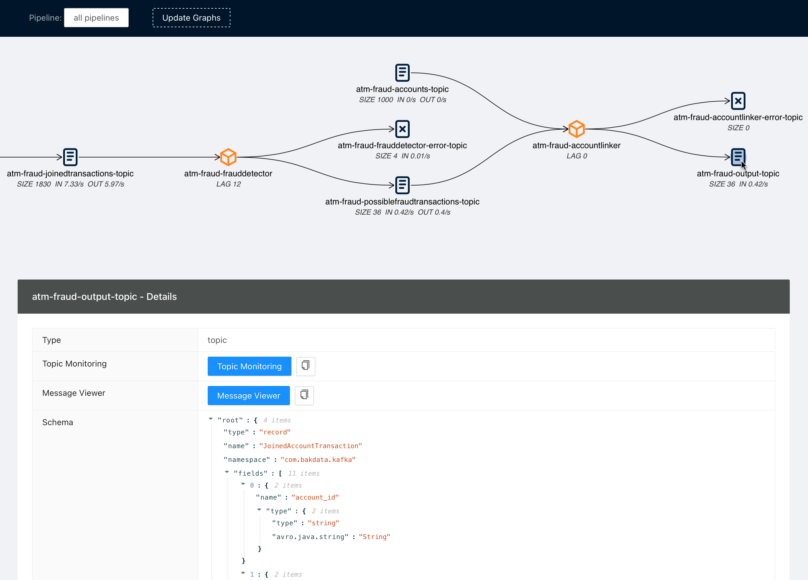

# Streams Explorer

> Explore Data Pipelines in Apache Kafka.



## Features

- Visualization of streaming applications and topics
- Monitor all or individual pipelines from namespace
- Inspection of Avro schema from schema registry
- Integration with [streams-bootstrap](https://github.com/bakdata/streams-bootstrap) for deploying Kafka streams applications
- Real-time metrics from Prometheus (consumer lag, topic size, messages in/out per second)
- Integration with external services for logging and analysis like Kibana, Grafana, AKHQ, Elasticsearch
- Customizable through Python plugins

## Installation

### Docker Compose

1. Forward the ports to Kafka Connect, Schema Registry, and Prometheus. (other integrations are optional)
2. Start the container

```sh
docker-compose up
```

Once the container is started visit <http://localhost:3000>

### Deploying to Kubernetes cluster

1. Add the Helm chart repository

```sh
helm repo add streams-explorer https://raw.githubusercontent.com/bakdata/streams-explorer/master/helm-chart/
```

2. Install

```sh
helm upgrade --install --values helm-chart/values.yaml streams-explorer
```

### Standalone

#### Backend

1. Install dependencies

```sh
pip install -r requirements.txt
```

2. Forward the ports to Kafka Connect, Schema Registry, and Prometheus. (other integrations are optional)
3. Configure the backend in [settings.yaml](backend/settings.yaml).
4. Start the backend server

```sh
uvicorn main:app
```

#### Frontend

1. Install dependencies

```sh
npm install
```

2. Start the frontend server

```sh
npm start
```

Visit <http://localhost:3000>

## Configuration

Depending on your type of installation set the configuration for the backend server in this file:

- **Docker Compose**: [docker-compose.yaml](docker-compose.yaml)
- **Kubernetes**: [helm-chart/values.yaml](helm-chart/values.yaml)
- **standalone**: [backend/settings.yaml](backend/settings.yaml)

The following configuration options are available:

#### Kafka Connect

- `kafkaconnect.url` url to Kafka Connect server (string, **required**, default: `http://localhost:8083`)
- `kafkaconnect.displayed_information` (list of dict, **required**, default: `[{'name': 'Transformer', 'key': 'transforms.changeTopic.regex'}]`)

#### Kubernetes

- `k8s.deployment.cluster` whether it is deployed to Kubernetes cluster (bool, **required**, default: `false`)
- `k8s.deployment.context` Name of Cluster (string, optional if running in cluster, default: `kubernetes-cluster`)
- `k8s.deployment.namespaces` Kubernetes namespaces (list of string, **required**, default: `['kubernetes-namespace']`)
- `k8s.containers.ignore` Name of containers that should be ignored/hidden (list of string, default: `['prometheus-jmx-exporter']`)
- `k8s.displayed_information` Details of Pod that should be displayed (list of dict, default: `[{'name': 'Labels', 'key': 'metadata.labels'}]`)
- `k8s.labels` Labels used to set attributes of nodes (list of string, **required**, default: `['pipeline']`)
- `k8s.independent_graph.label` Attribute of nodes the pipeline name should be extracted from (string, **required**, default: `pipeline`)

#### Schema Registry

- `schemaregistry.url` url to Schema Registry (string, **required**, default: `http://localhost:8081`)

#### AKHQ

- `akhq.url` url to AKHQ (string, default: `http://localhost:8080`)
- `akhq.cluster` Name of cluster (string, default: `kubernetes-cluster`)

#### Grafana

- `granfa.url` url to Grafana (string, default: `http://localhost:3000`)
- `grafana.dashboard` path to Dashboard (string)

#### Kibana

- `kibanalogs.url` url to Kibana logs (string, default: `http://localhost:5601`)

#### Elasticsearch

- `esindex.url` url to Elasticsearch index (string, default: `http://localhost:5601/app/kibana#/dev_tools/console`)

#### Prometheus

- `prometheus.url` url to Prometheus (string, **required**, default: `http://localhost:9090`)

#### Plugins

- `plugins.path` path to folder containing plugins relative to backend (string, **required**, default: `./plugins`)
- `plugins.extractors.default` whether to load default extractors (bool, **required**, default: `true`)

## Demo pipeline

[ATM Fraud detection with streams-bootstrap](https://github.com/bakdata/streams-explorer/blob/main/demo-atm-fraud/README.md)
